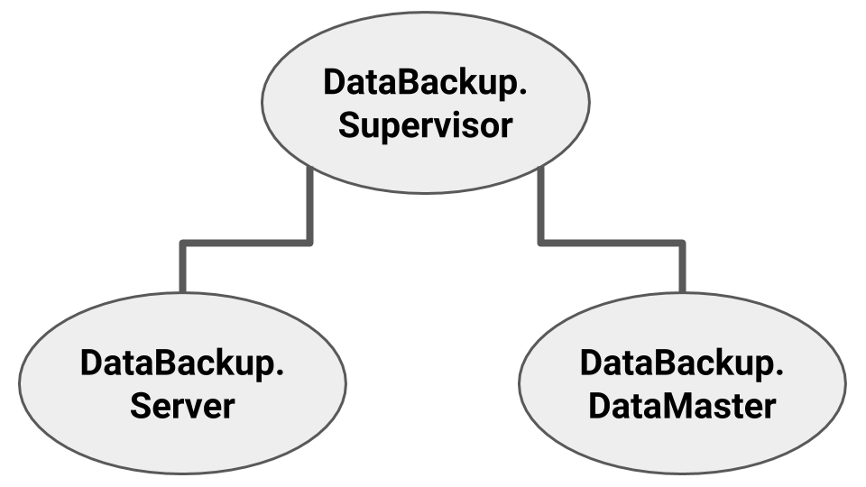

# The Situation

We have a GenServer that, on initialization, pulls frequently accessed records from a database and serves that data to users. Everything is going well, but then Murphy's law strikes, and the server crashes, destroying all of the innocent data along with it. Fortunately, we've leveraged the power of Elixir and built a resilient system, so our supervisor restarts the server, which then makes an expensive call to the database to reload all that same information. In about half a minute everything is available again. Not bad, but can we do better?

# The Options

There are a few ways to preserve state when a process crashes. Probably the most obvious, we could let the server simply handle it's own exit via the `terminate/2` function:

```elixir
def terminate(reason, state) do
  # Sends state to another GenServer. During
  # init on restart, will load the state from
  # OtherServer.
  OtherServer.hold_my_beer(state)
end
```

In most situations, that works just fine. But there are a few drawbacks. First, [not every exit will invoke `terminate/2`](https://hexdocs.pm/elixir/GenServer.html#c:terminate/2). Second, if we have a particularly large data set, moving it twice (once to `OtherServer`, and then once back to our server on restart) can be an expensive operation. Third, we are adding additional complexity to our server by requiring it to deal with issues besides data access and manipulation - a clear departure from the "let it fail" philosophy.

As long as the data set is small and the exceptions to `terminate/2` are acceptable, then this solution works ok. But what if the data you're working with is significantly larger?

# Erlang Term Storage

Enter `:ets`, or "ehts", or "ee tee es". However you pronounce it, [ETS](http://erlang.org/doc/man/ets.html) is an effective in-memory term storage provided by erlang that offers constant time data access. You can create a table within a process and it will live as long as your process does...and, despite some [common misconceptions](https://elixirschool.com/en/lessons/specifics/ets/#overview), even well beyond in some cases.

Erlang's `:ets` module provides us a couple ways to efficiently solve our problem with how to gracefully handle preservation of large sets of data if we store that data in an ETS table. First, there's the [`:ets.give_away/3`](http://erlang.org/doc/man/ets.html#give_away-3) function that allows a process to transfer ownership of an ETS table to another process. By avoiding the transfer of huge swaths of data between processes, that function helps solve our transfer issues from the `terminate/2` solution outline above. Unfortunately, we're still left with the other issues.

To simplify all of that, we can instead set an `heir` when creating a new ETS table. The identified `heir`, as a pid, will inherit ownership of the table if it's current owner terminates. No need to explicitly tell an ETS table where to go when I die...now we just need somewhere for it to go.

# An Example

[Source Code](https://github.com/davelively14/data-backup)

For the purpose of this exercise, we're going to create a simple OTP app:


Our `Supervisor` will start two workers: `DataMaster`, which creates, distributes, and inherits the ETS table, and `Server`, which will assume ownership of the ETS table during initialization and handle data access and manipulation. We'll dig into each of these over the next few sections.

### DataMaster

`DataMaster` is the ultimate guardian of our ETS table in three ways.

First, it creates the ETS table:

```elixir
@table_name :data
...
def init(_) do
  # 1
  :ets.new(@table_name, [:set, :protected, :named_table, {:heir, self(), nil}])

  {:ok, %{ets: @table_name}}
end
```
<small>**BackupData.DataMaster.init/1** *Building the ETS table*</small>

During the ETS creation (\#1), `DataMaster` sets itself as the `heir`. If any other process assumes ownership of this ETS table and happens to crash, then by default `DataMaster` will regain ownership and the ETS table will be preserved. No transfer of data, no issues where `terminate/2` doesn't fire, and we can just let our `Server` fail.

```elixir
def get_ets do
  GenServer.call(__MODULE__, :get_ets)
end
...
def handle_call(:get_ets, _from, nil), do: {:reply, nil, nil}
def handle_call(:get_ets, {pid, _ref}, %{ets: ets}) do
  :ets.give_away(ets, pid, nil)
  {:reply, ets, nil}
end
```
<small>**BackupData.DataMaster.get_ets/0** *Distributing the ETS table*</small>

The `get_ets/0` function allows other processes to request and, if available, assume ownership of the ETS table.

```elixir
def handle_info({:"ETS-TRANSFER", @table_name, _origin, _gift_data}, _state) do
  {:noreply, %{ets: @table_name}}
end
```
<small>**BackupData.DataMaster.handle_info/2:"ETS-TRANSFER"** *Re-owning*</small>

Whenever a process is identified as the owner of an ETS table, that process will receive the message `{:"ETS-TRANSFER", table_name, origin_pid, misc_data}`. In this case, when `DataMaster` receives ownership of the same table again, it will adjust it's state accordingly and be ready to distribute it again.

### Server

The `Server` handles everything related to storing and retrieving data via `:ets.insert/2` and `:ets.lookup/2` functions. Unfortunately, `Server` initially can't access the ETS table due to the `protected` option we passed, which affords read only privileges to every other process. The remedy is simple enough: get ownership.

```elixir
def init(_) do
  {:ok, %{ets: DataBackup.DataMaster.get_ets()}}
end
```
<small>**BackupData.Server.init/1** *Takes ownership on init*</small>

Upon initialization, `Server` will request ownership via the previously discussed `DataMaster.get_ets/0` function and store the name of that table in state. Whether that's the first time the app is started or if coming back from the dead, `Server`.

```elixir
def insert_data(id, data) do
  GenServer.call(__MODULE__, {:insert_data, id, data})
end

def get_data(id) do
  GenServer.call(__MODULE__, {:get_data, id})
end
...
def handle_call({:insert_data, id, data}, _from, state) do
  :ets.insert(state.ets, {id, data})
  {:reply, :ok, state}
end

def handle_call({:get_data, id}, _from, state) do
  record =
    state.ets
    |> :ets.lookup(id)
    |> List.first
  {:reply, record, state}
end
```
<small>**BackupData.Server** *Data manipulation functions.*</small>

And some basic functions for creating rows and finding them.

# Conclusion

Using an ETS table allows us to separate in-memory data functionality from the implementation of our application. `Server` is no longer responsible for maintaining and preserving the data and can instead focus on serving and manipulating that data. We use `DataMaster` to provide a greater degree of reliability in maintaining the life of in-memory data. All of that happens with only a few simple lines of code thanks to erlang's built in ETS functionality.

If you're interested in digging deeper, check out the [repo on GitHub](https://github.com/davelively14/data-backup). I'd recommend paying special attention to the [tests](https://github.com/davelively14/data-backup/tree/master/test), as they'll give you a good idea of how this simple OTP app works.

Bonus points if you figured out the photo is actually of our ETS and `Server`: one can't be killed by fire, the other can come back from the dead. This story is about how to get them to sing together.
